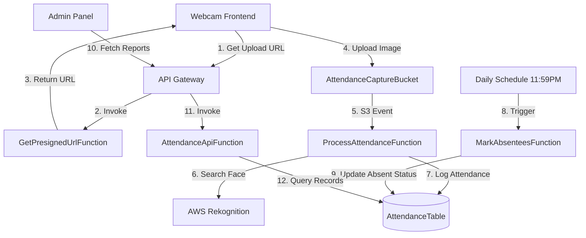

# Contactless Attendance System 🚀

[](https://aws.amazon.com/)
[](https://aws.amazon.com/serverless/sam/)
[](https://www.python.org/)
[](https://aws.amazon.com/rekognition/)

A state-of-the-art serverless attendance system leveraging facial recognition for contactless clock-in and clock-out. Built with AWS SAM, Rekognition, and DynamoDB.

---

## 📖 Overview

This system provides a modern, touchless solution for tracking employee attendance. Employees simply look at a camera, and the system identifies them using AWS Rekognition, logging their entry or exit times automatically in a DynamoDB table.

### Key Features
- **Facial Recognition:** Fast and accurate identity verification.
- **Serverless Architecture:** Scalable and cost-effective (Pay-per-use).
- **Automated Absence Tracking:** Daily cron jobs mark employees as absent if they don't clock in.
- **Admin Dashboard:** Manage employee records and view attendance reports.
- **Secure Storage:** Images are stored temporarily in S3 and automatically deleted.

---

## 🏗️ Architecture



---

## 📁 Project Structure

```text
Attendance-System/
├── frontend/               # Web interfaces
│   ├── index.html          # Employee Clock-in UI
│   ├── admin.html          # Admin Dashboard
│   ├── app.js              # Employee logic
│   └── admin.js            # Admin logic
├── src/                    # Backend Lambda Handlers
│   └── handlers/
│       ├── get_presigned_url.py  # Generates S3 upload URLs
│       ├── process_attendance.py # Rekognition & DDB logic
│       ├── mark_absentees.py     # Daily cleanup job
│       └── attendance_api.py      # CRUD for reports & employees
├── scripts/                # Utility scripts
│   └── setup_rekognition.py # Initialize Rekognition collection
├── template.yaml           # AWS SAM Infrastructure Template
└── README.md               # You are here!
```

---

## 🛠️ Setup and Deployment

### Prerequisites
- [AWS CLI](https://aws.amazon.com/cli/) configured with admin permissions.
- [AWS SAM CLI](https://docs.aws.amazon.com/serverless-application-model/latest/developerguide/serverless-sam-cli-install.html) installed.
- Python 3.9 or higher.

### Steps

1. **Clone and Build:**
   ```bash
   sam build
   ```

2. **Deploy:**
   ```bash
   sam deploy --guided
   ```
   *Follow the prompts and take note of the `ApiUrl` in the outputs.*

3. **Initialize Rekognition:**
   Run the setup script to create the face collection in AWS Rekognition:
   ```bash
   python scripts/setup_rekognition.py
   ```

4. **Connect Frontend:**
   - Update `frontend/app.js` and `frontend/admin.js`.
   - Find the constant `API_URL` and replace its value with your deployed `ApiUrl`.

5. **Register Employees:**
   - Upload employee profile pictures to the `EmployeeProfileBucket` to index their faces.
   - Or use the Admin panel (if implemented) to add new profiles.

---

## 🛡️ Security & Privacy

- **Data Minimization:** Captured images in `AttendanceCaptureBucket` are automatically deleted after 24 hours via S3 Lifecycle rules.
- **Encryption:** All data in DynamoDB is encrypted at rest.
- **Access Control:** IAM roles follow the principle of least privilege, ensuring each Lambda only has access to what it needs.

---

## 🚀 Future Enhancements
- [ ] Implement MFA for Admin panel.
- [ ] Add real-time notifications via SNS (e.g., alert if unauthorized access is detected).
- [ ] Support for multi-face detection in a single frame.
- [ ] Detailed PDF/Excel export for attendance reports.

---

## 📄 License
This project is licensed under the MIT License.
